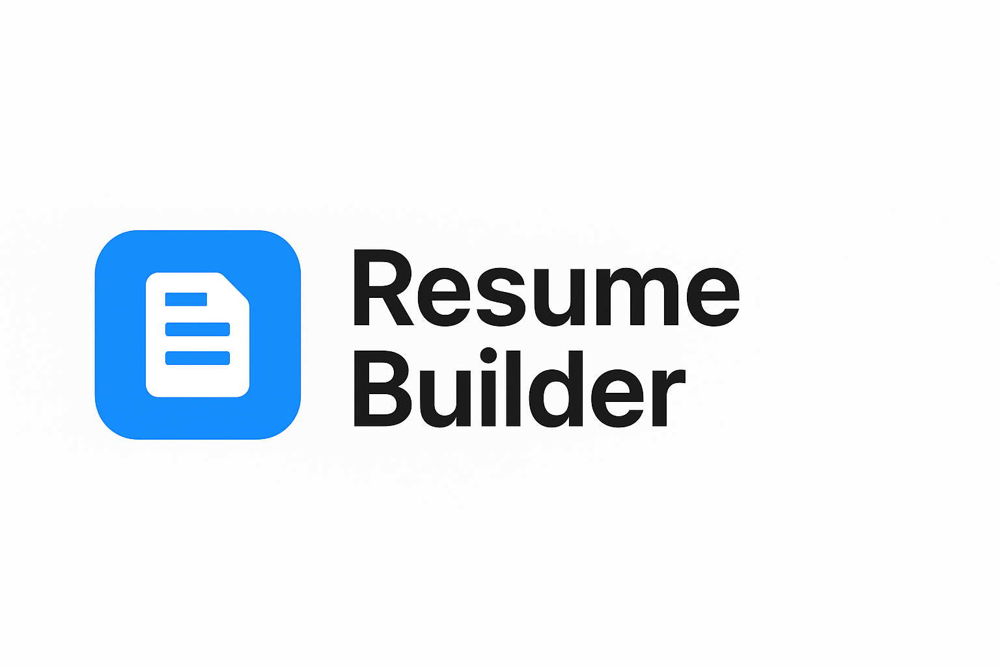
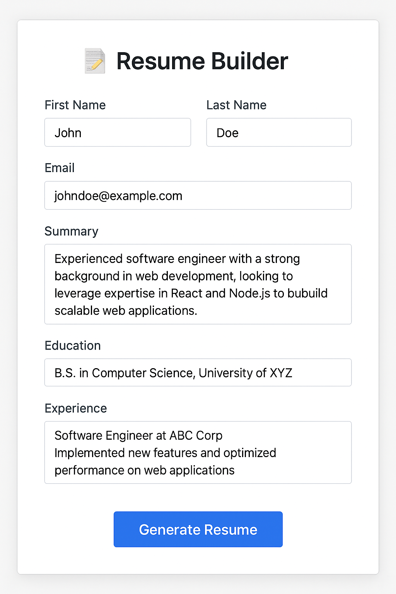
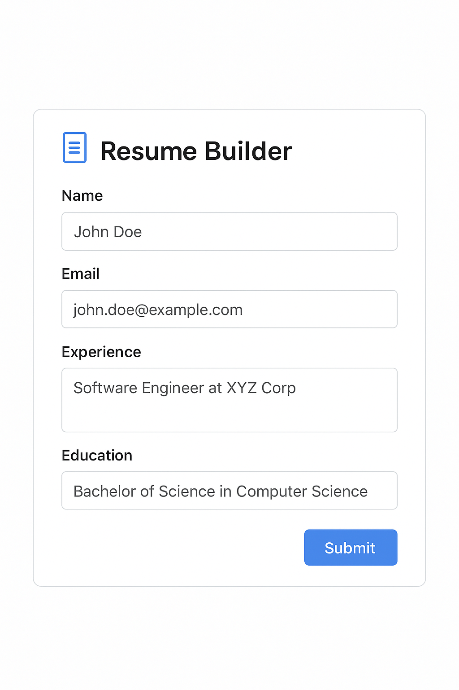
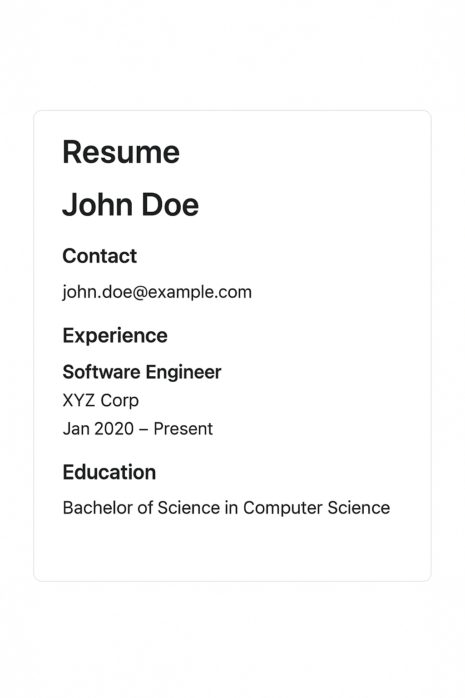

cd "E:/Mini projects/resume-generator" && cat > README.md << 'EOF'
# 🧾 Resume Generator  



An interactive **React-based Resume Builder** that allows users to create, customize, and preview resumes in multiple templates.  

---

## ✨ Features  

- 🎨 **Multiple Templates** – Classic, Modern, Minimal  
- 📝 **Live Preview** – See changes instantly while editing  
- 📂 **Export Ready** – Easily save or print resumes as PDF  
- ⚡ **Responsive Design** – Works seamlessly on desktop & mobile  
- 🎯 **Simple UI** – Clean form-based data entry  

---

## 🚀 Tech Stack  

- **Frontend:** React.js  
- **Styling:** CSS (custom styles, responsive design)  
- **State Management:** React Hooks (`useState`)  
- **Build Tooling:** Vite / Create React App (depending on setup)  

---

## 📸 Preview  

| Form Entry | Resume Preview | Template Switcher |  
|------------|----------------|-------------------|  
|  |  |  |  

---

## ⚡ Getting Started  

Follow these steps to run the project locally:  

```bash
# Clone the repository
git clone https://github.com/your-username/resume-generator.git

# Navigate into project folder
cd resume-generator

# Install dependencies
npm install

# Start development server
npm run dev

#resume-generator/
│
├── src/
│   ├── components/
│   │   ├── ResumeForm.jsx
│   │   ├── ResumePreview.jsx
│   │   ├── TemplateSwitcher.jsx
│   │
│   ├── App.jsx
│   ├── styles.css
│   └── main.jsx
│
├── public/
├── package.json
├── README.md
└── ...

```bash
---

## 🧑‍💻 Author

Made with 🐦‍🔥 by Abdullah Arif
